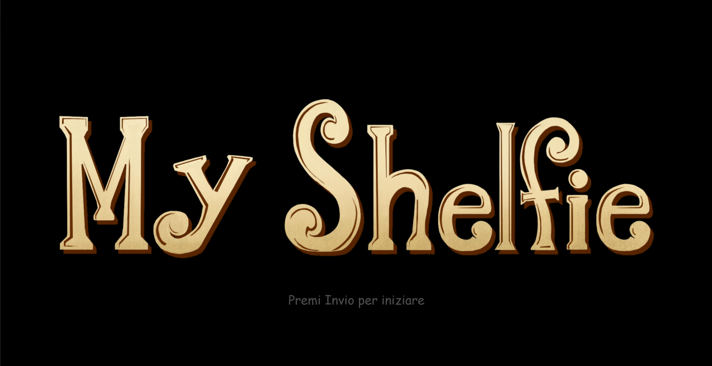
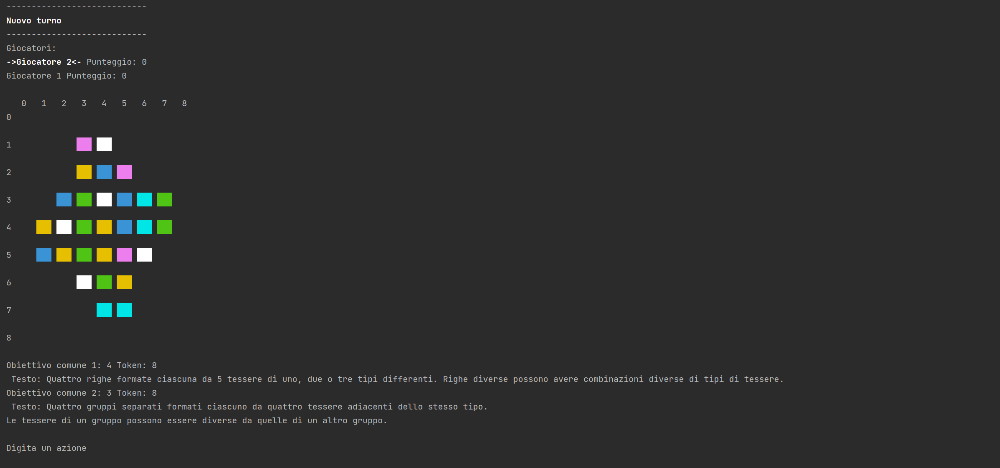

# Corso Ingegneria del Software 2023 - Cremona

## My Shelfie

My Shelfie è un'applicazione interattiva ispirata all'omonimo gioco da tavolo targato Cranio. 
Raccogli gli oggetti sul tuo salotto, e usali per rimepire la tua libreria. 
Completa gli obbiettivi, ottieni le coccarde e vinci!

### Come giocare

Apri l'app sul tuo dispositivo, e scegli che tipo di interfaccia usare. Poi crea una partita da 2, 3 o 4 giocatori, o unisciti ad una partita esistente. una volta che tutti i giocatori si saranno uniti, inizia il divertimento!
Quando è il tuo turno, seleziona le tessere che vuoi prelevare dalla plancia, e inserscile nella tua libreria. Cerca di ottenere punti tramite le adiacenze, o completando gli obbiettivi comuni e quelli personali.
Ma anche durante il turno degli altri avrai un gran da fare. Potrai guardare le librerie altrui, consultare i tuoi obbiettivi, oppure chattare con gli altri giocatori! 

### Screenshot

